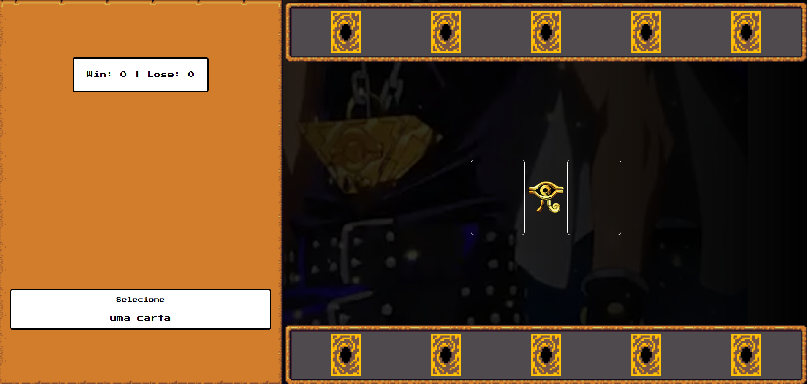

🎴 Yu-Gi-Oh! Jo-Ken-Po
======================

Bem-vindo ao **Yu-Gi-Oh! Jo-Ken-Po**! 🌟 Um mini game inspirado no universo de **Yu-Gi-Oh!**, combinando a mecânica clássica do **Jo-Ken-Po (Pedra, Papel e Tesoura)** com cartas icônicas do anime. Prepare-se para duelar e desafiar a máquina! ⚔️🔥

* * * * *

🚀 Funcionalidades
------------------

✅ **Batalha**: Escolha uma carta e enfrente o computador num duelo de Jo-Ken-Po! 🥋⚡\
✅ **Cartas Icônicas**: Blue Eyes White Dragon, Dark Magician e Exodia esperam por você! 🎴✨\
✅ **Sistema de Pontuação**: O jogo registra suas vitórias e derrotas ao longo das partidas. 📊🏆\
✅ **Efeitos Sonoros**: Sons e trilha sonora inspirados no anime para imersão total! 🎵🎶\
✅ **Interface Dinâmica**: Design retrô inspirado nos jogos clássicos de Yu-Gi-Oh! 🕹️🎨

* * * * *

🔥 Como Jogar?
--------------

1️⃣ **Escolha uma carta** na parte inferior da tela. 2️⃣ **Clique sobre ela** para lançá-la no campo de batalha. 3️⃣ **Aguarde** a jogada do computador. 4️⃣ **O resultado será exibido** com base na regra do Jo-Ken-Po:

-   ◽ Pedra (Rock) vence Tesoura (Scissors).

-   📄 Papel (Paper) vence Pedra (Rock).

-   ✂️ Tesoura (Scissors) vence Papel (Paper). 5️⃣ **O placar será atualizado** e você pode iniciar um novo duelo!

* * * * *

📌 Tecnologias Utilizadas
-------------------------

-   ⚡ **JavaScript** (Manipulação de DOM, lógica do jogo e eventos)

-   🎨 **HTML5** (Estruturação do game)

-   🎭 **CSS3** (Estilização e efeitos visuais)

-   🎶 **Áudio** (Efeitos sonoros e trilha temática)

* * * * *

📂 Estrutura do Projeto
-----------------------

```
📁 src/
 ├── 📁 assets/
 │   ├── 🎴 icons/ (Sprites das cartas)
 │   ├── 🎵 audios/ (Sons do jogo)
 │   ├── 🎥 video/ (BG animado)
 ├── 📁 styles/
 │   ├── 🎨 main.css (Estilos principais)
 │   ├── 🎨 reset.css (Reset de estilos)
 │   ├── 🎨 buttons.css (Botões personalizados)
 ├── 📁 scripts/
 │   ├── 🎮 engine.js (Lógica principal do jogo)
 ├── 📝 index.html (Página principal)
```

* * * * *

🎥 Demonstração
---------------

🎮 Confira um trecho do game em ação!

🚀 

* * * * *

📢 Contato
----------

📌 Criado por: **João Victor Ricci** (Juuvito) 👨‍💻\
🔗 [LinkedIn](https://www.linkedin.com/in/joaoriccideveloper/)\
🐱 [GitHub](https://github.com/ricciDeveloper)

Se tiver dúvidas, sugestões ou quiser contribuir, sinta-se à vontade para entrar em contato! 🚀🎮